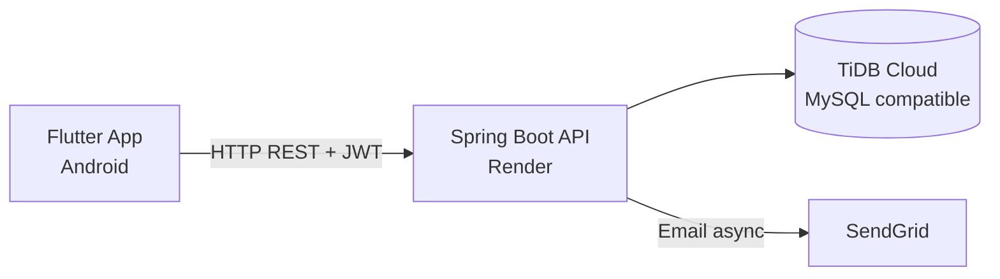
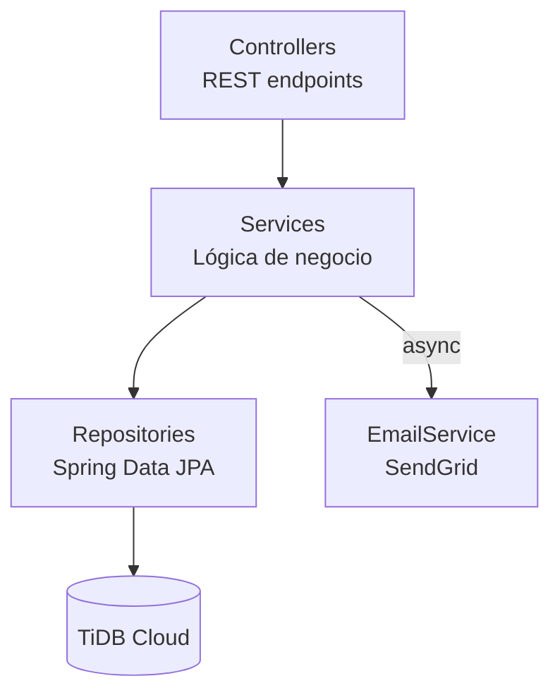
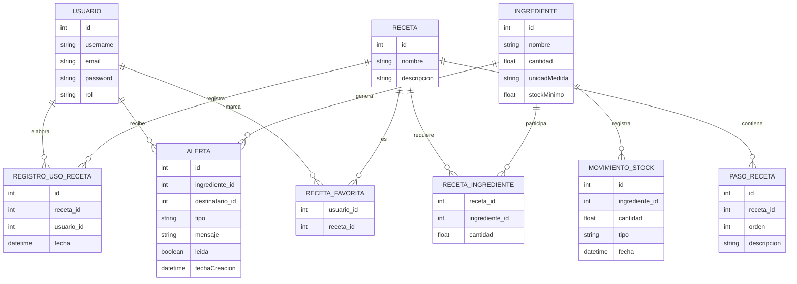

# OhMyFreezer


Sistema de gestión de inventario y recetas para cocinas profesionales. Permite controlar el stock de ingredientes, elaborar recetas paso a paso y recibir alertas automáticas por email cuando el stock cae por debajo del mínimo definido.

> Proyecto de fin de ciclo DAM, con intención de implementación real en restaurante.

---

## Demo

**API:** https://ohmyfreezer-backend.onrender.com  
**APK:** distribución manual

---

## Stack

| Capa       | Tecnologías |
| ---------- | ----------- |
| Backend    | Java 21 · Spring Boot 3.5 · Spring Data JPA · Spring Security + JWT · TiDB Cloud · SendGrid · Maven |
| Frontend   | Flutter 3 · Provider · http · Hive · fl_chart · flutter_local_notifications |

---

## Arquitectura



### Backend en capas



---

## Modelo de datos



---

## Roles

| Rol            | Permisos |
| -------------- | -------- |
| Cocinero       | Consultar ingredientes y recetas · Elaborar recetas paso a paso · Marcar favoritos |
| Jefe de cocina | Todo lo anterior · Gestionar recetas e ingredientes · Ver estadísticas · Recibir alertas por email |

El registro como **Jefe de cocina** requiere un código secreto (`BUSSINES_LOGIC_CODE`) conocido solo por el equipo.

> **Nota (multi-tenancy):** desde la Fase 1 de multi-tenancy, el registro público
> de Jefe de cocina ya NO usa `BUSSINES_LOGIC_CODE` — usa un código de alta
> (`codigoRegistro`) propio de cada Negocio. Ver la siguiente sección. La
> limpieza de esta línea/propiedad legacy queda para la Fase 9 (PR 6/6).

---

## Alta de un nuevo Negocio (onboarding)

Cada Negocio (tenant) se provisiona **manualmente**, fuera de banda — no hay
UI de administración en esta fase. El alta consiste en:

1. Insertar el Negocio:
   ```sql
   INSERT INTO negocios (nombre, plan, fecha_alta, email_contacto)
   VALUES ('Nombre del negocio', 'FREE', NOW(6), 'contacto@negocio.com');
   ```
2. Insertar un código de alta de un solo uso para ese Negocio (usar el `id`
   devuelto por el INSERT anterior):
   ```sql
   INSERT INTO negocio_signup_codes (negocio_id, codigo, usado, activo, fecha_creacion)
   VALUES (<id_del_negocio>, 'CODIGO-UNICO-PARA-ESTE-NEGOCIO', 0, 1, NOW(6));
   ```
3. Compartir `codigoRegistro` con el primer Jefe de cocina del negocio, que lo
   consume una única vez en `POST /api/usuarios/register`. El código queda
   marcado como usado (`usado=1`) tras el registro y no puede reutilizarse.
4. A partir de ahí, ese Jefe crea a sus empleados desde la propia app
   (`POST /api/usuarios/empleados`, autenticado) — no necesitan código, heredan
   el negocio del Jefe automáticamente.

Un código puede revocarse antes de usarse poniendo `activo=0` manualmente.

---

## Sistema de alertas

Se generan alertas automáticas ante tres situaciones:

| Tipo | Cuándo se genera |
| ---- | ---------------- |
| `STOCK_BAJO` | Un ingrediente cae por debajo de su stock mínimo al elaborar una receta |
| `MERMA` | Se detecta una reducción de stock por pérdida o descarte |
| `RECETA_NO_DISPONIBLE` | No hay stock suficiente para elaborar una receta |

Las alertas se guardan en base de datos y se envían por email al jefe de cocina de forma **asíncrona** usando **SendGrid**.

> SendGrid se eligió porque Render bloqueaba las conexiones SMTP de Spring Mail.

---

## Estructura del repositorio

```
OhMyFreezer/
├── backend/                  # API REST (Spring Boot)
│   ├── src/main/java/com/ares/backend/
│   │   ├── config/           # Seguridad, JWT, CORS, Swagger, async
│   │   ├── controller/       # Endpoints REST
│   │   ├── service/          # Lógica de negocio
│   │   ├── repository/       # Acceso a datos (JPA)
│   │   ├── entity/           # Entidades JPA
│   │   ├── dto/              # Request y response objects
│   │   └── exception/        # Manejo global de errores
│   └── src/test/             # Tests unitarios (JUnit 5 + Mockito)
│
└── frontend/flutter_app/     # App Android (Flutter)
    ├── lib/
    │   ├── models/           # Modelos de datos
    │   ├── services/         # Llamadas a la API
    │   ├── providers/        # Estado global (Provider)
    │   ├── screens/          # Pantallas
    │   ├── widgets/          # Componentes reutilizables
    │   └── theme/            # Colores, estilos, assets
    └── pubspec.yaml
```

---

## Configuración del backend

### Perfiles Spring

| Perfil | DDL | SQL log | Swagger | Stack traces |
| ------ | --- | ------- | ------- | ------------ |
| `dev`  | update | sí | sí | sí |
| `prod` | validate | no | no | no |

### Variables de entorno

| Variable | Descripción |
| -------- | ----------- |
| `SPRING_PROFILES_ACTIVE` | Perfil Spring activo (`dev` o `prod`); controla DDL, logging SQL, Swagger y stack traces según la tabla anterior. |
| `ALLOWED_ORIGINS` | Lista de orígenes permitidos (separados por coma) para CORS; por defecto `http://localhost:3000`. |
| `JWT_SECRET_CODE` | Clave secreta (≥32 bytes) usada para firmar y validar los tokens JWT con HS256. |

---

## Ejecutar en local

### Backend

```bash
cd backend
./mvnw spring-boot:run
```

Las variables de entorno se configuran en el sistema operativo o en el servidor.

### Frontend

```bash
cd frontend/flutter_app
flutter pub get
flutter run
```

La URL del backend se detecta automáticamente en desarrollo (emulador Android → `10.0.2.2`).  
Para producción:

```bash
flutter build apk --dart-define=API_BASE_URL=https://ohmyfreezer-backend.onrender.com/api
```

---

## Endpoints

| Módulo               | Base URL                 |
| -------------------- | ------------------------ |
| Usuarios             | `/api/usuarios`          |
| Ingredientes         | `/api/ingredientes`      |
| Recetas              | `/api/recetas`           |
| Alertas              | `/api/alertas`           |
| Favoritos            | `/api/favoritos`         |
| Registros de uso     | `/api/registros`         |
| Movimientos de stock | `/api/movimientos`       |
| Estadísticas         | `/api/estadisticas`      |

---

## Tests

Tests unitarios sobre la capa de servicio con **JUnit 5 + Mockito**.

| Servicio | Cobertura |
| -------- | --------- |
| `UsuarioService` | Registro, login, actualización, eliminación |
| `IngredienteService` | CRUD, reducción y actualización de stock |
| `RecetaService` | CRUD, elaboración, verificación de disponibilidad |
| `AlertaService` | Creación por tipo, marcado como leída |
| `FavoritoService` | Marcar, desmarcar, verificar, listar |
| `RegistroUsoService` | Crear, obtener, eliminar por receta |

```bash
cd backend
./mvnw test
```

---

## Persistencia local (Flutter)

La app usa **Hive** para persistir la sesión entre reinicios. Se almacena en un único box (`authBox`):

| Clave | Contenido |
| ----- | --------- |
| `token` | JWT de la sesión activa |
| `usuarioId` | ID del usuario autenticado |
| `username` | Nombre de usuario |
| `email` | Email del usuario |
| `esJefeCocina` | Rol del usuario (booleano) |
| `isFirstLaunch` | Si es la primera vez que se abre la app (controla el onboarding) |

---

## Notas de despliegue

El backend está desplegado en **Render** en su plan gratuito, que apaga la instancia tras 15 minutos de inactividad. Para evitarlo, el servicio incluye un `KeepAlivePingService` que hace ping periódico al propio endpoint `/api/ping`.

---

## Autor

**Ares Caballero** — Proyecto de fin de ciclo DAM  
[GitHub](https://github.com/aresmendi) · [LinkedIn](https://linkedin.com/in/ares-caballero)
