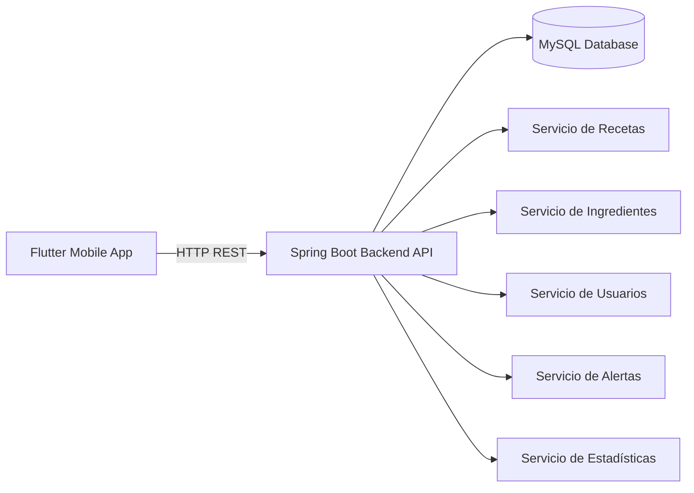
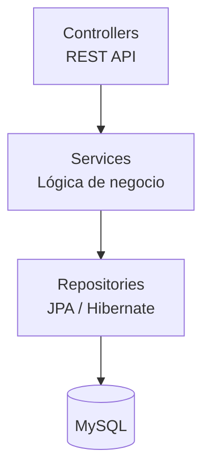
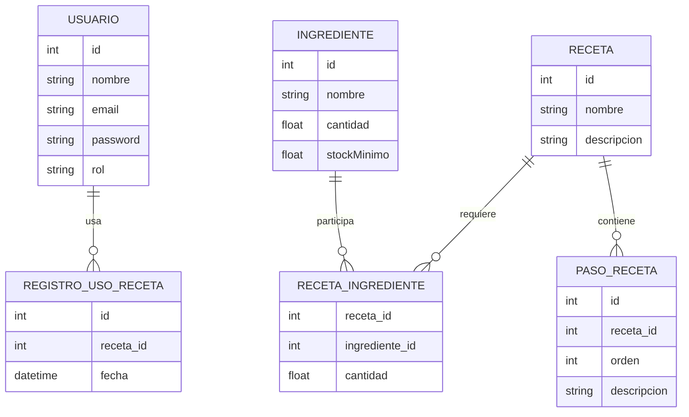

# 🍳 OhMyFreezer


> Sistema profesional de gestión de ingredientes y recetas para cocinas profesionales.

**OhMyFreezer** permite a los equipos de cocina gestionar su inventario de ingredientes, consultar recetas paso a paso, registrar elaboraciones y recibir alertas automáticas cuando el stock cae por debajo del mínimo definido.

---

# 📸 Visión general

El sistema está compuesto por:

* **Backend REST API** desarrollado con **Spring Boot**
* **Base de datos relacional** en **MySQL**
* **Aplicación móvil** desarrollada con **Flutter**

Permite centralizar la gestión de cocina y mejorar el control de inventario.

---

# 🏗 Arquitectura del sistema



---

# 🧱 Arquitectura del Backend

El backend sigue una **arquitectura en capas** típica de Spring Boot.



### Capas

**Controller**

* Expone los endpoints REST
* Maneja las peticiones HTTP

**Service**

* Contiene la lógica de negocio
* Valida datos
* Coordina repositorios

**Repository**

* Acceso a base de datos mediante **Spring Data JPA**

---

# 🗄 Modelo conceptual de datos



---

# 📁 Estructura del repositorio

```
OhMyFreezer
│
├── backend
│   ├── controller
│   ├── service
│   ├── repository
│   ├── entity
│   ├── dto
│   └── config
│
└── frontend
    └── flutter_app
```

---

# 🔧 Backend

## Tecnologías

* Java 21
* Spring Boot 3.5
* Spring Data JPA + Hibernate
* Spring Security + JWT
* MySQL 8
* Maven

---

## Requisitos

* JDK 21+
* MySQL 8
* Maven 3.8+

---

## Configuración

```bash
cd backend
cp .env.example .env
# Rellená los valores reales en .env
```

### Variables de entorno requeridas

| Variable | Descripción |
|----------|-------------|
| `BD_URL` | JDBC URL de MySQL (ej: `jdbc:mysql://localhost:3306/ohmyfreezer?useSSL=false&serverTimezone=Europe/Madrid`) |
| `BD_USER` | Usuario de la base de datos |
| `BD_PASSWORD` | Contraseña de la base de datos |
| `JWT_SECRET_CODE` | Clave secreta para firmar tokens JWT (mínimo 32 caracteres) |
| `BUSSINES_LOGIC_CODE` | Código secreto para registro de jefes de cocina |
| `SPRING_MAIL_USERNAME` | Email Gmail para envío de alertas |
| `SPRING_MAIL_PASSWORD` | App Password de Gmail ([generala aquí](https://myaccount.google.com/apppasswords)) |
| `ALLOWED_ORIGINS` | Orígenes CORS permitidos, separados por coma |
| `SPRING_PROFILES_ACTIVE` | `dev` (local) o `prod` (servidor) |

### Perfiles Spring

| Perfil | DDL | SQL log | Swagger | Stack traces |
|--------|-----|---------|---------|--------------|
| `dev` | update | sí | sí | sí |
| `prod` | validate | no | no | no |

---

## Ejecutar backend

```bash
cd backend
export $(cat .env | grep -v '^#' | xargs)
./mvnw spring-boot:run
```

API disponible en:

```
http://localhost:8080/api
```

Swagger (solo perfil `dev`):

```
http://localhost:8080/swagger-ui/index.html
```

---

# 🔌 Endpoints principales

| Módulo       | Endpoint            |
| ------------ | ------------------- |
| Usuarios     | `/api/usuarios`     |
| Ingredientes | `/api/ingredientes` |
| Recetas      | `/api/recetas`      |
| Alertas      | `/api/alertas`      |
| Registros    | `/api/registros`    |
| Estadísticas | `/api/estadisticas` |

---

# 📱 Frontend (Flutter)

## Tecnologías

* Flutter 3
* Provider (gestión de estado)
* http (cliente REST)
* shared_preferences
* flutter_local_notifications
* connectivity_plus

---

## Requisitos

* Flutter SDK 3+
* Android Studio o VSCode
* Emulador Android o dispositivo físico

---

## Configuración

La URL del backend se configura en tiempo de compilación via `--dart-define`.  
En desarrollo, detecta automáticamente el emulador Android (10.0.2.2) o localhost.

## Ejecutar aplicación

**Desarrollo:**
```bash
cd frontend/flutter_app
flutter pub get
flutter run
```

**Producción** (apuntando a tu API real):
```bash
flutter build apk --dart-define=API_BASE_URL=https://tu-api.com/api
flutter build ios --dart-define=API_BASE_URL=https://tu-api.com/api
```

---

# 👥 Roles de usuario

| Rol            | Permisos                                                            |
| -------------- | ------------------------------------------------------------------- |
| Cocinero       | Consultar ingredientes y recetas, elaborar recetas paso a paso      |
| Jefe de cocina | Gestionar recetas e ingredientes, ver estadísticas, recibir alertas |

---

# 🔔 Sistema de alertas

El sistema genera **alertas automáticas** cuando un ingrediente cae por debajo de su `stockMinimo`.

Funcionamiento:

1. Se descuenta stock al elaborar una receta
2. El backend comprueba el nivel mínimo
3. Se genera una alerta si es necesario
4. La app consulta alertas periódicamente

---

# 🚀 Roadmap

Próximas mejoras:

* Dashboard de estadísticas avanzado
* Exportación de informes
* Integración con tablets en cocina
* Sistema de pedidos internos

---

# 📌 Estado del proyecto

| Módulo        | Estado           |
| ------------- | ---------------- |
| Backend       | ✅ Implementado   |
| Frontend      | 🚧 En desarrollo |
| Base de datos | ✅ Modelada       |

---

# 📄 Licencia

Proyecto desarrollado con fines educativos y profesionales.

---

# 👨‍💻 Autor

**Ares Caballero**

Proyecto desarrollado como parte de un sistema de gestión para cocinas profesionales.
